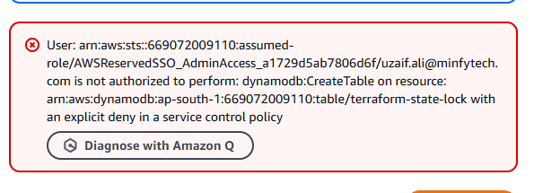

Not allowed to make dynaboDB table

A remote backend can be created without DynamoDB by using the S3 bucket only. We can store the Terraform state file in the S3 bucket, but this will not include state locking, which is typically handled by DynamoDB. It means concurrent Terraform runs may corrupt the state file if not handled carefully.

